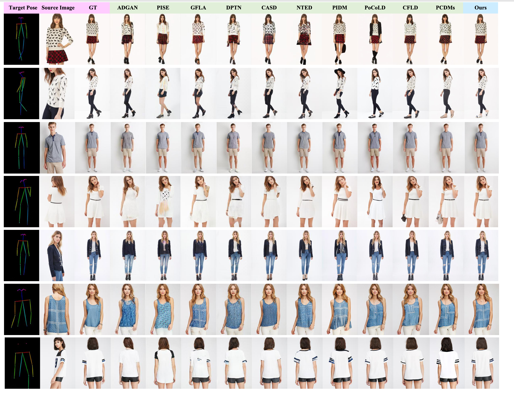
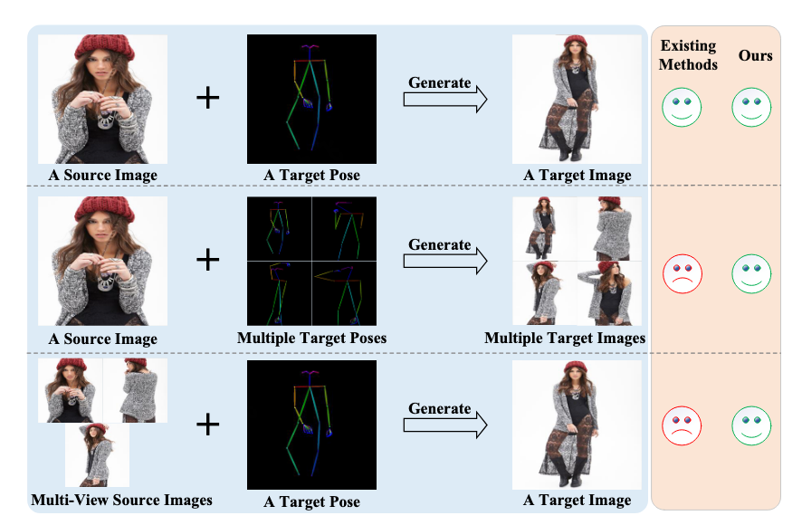
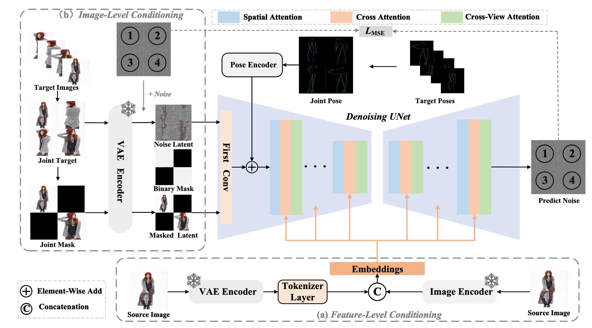

# IMAGPose
Implementation code：**[IMAGPose: A Unified Conditional Framework for Pose-Guided Person Generation](https://openreview.net/pdf?id=6IyYa4gETN)**, accepted at Annual Conference on Neural Information Processing Systems (NeurIPS) 2024.


## Abstract
Diffusion models represent a promising avenue for image generation, having demonstrated competitive performance in pose-guided person image generation. However, existing methods are limited to generating target images from a source image and a target pose, overlooking two critical user scenarios: generating multiple target images with different poses simultaneously and generating target images from multi-view source images. To overcome these limitations, we propose IMAGPose, a unified conditional framework for pose-guided image generation, which incorporates three pivotal modules: a feature-level conditioning (FLC) module, an image-level conditioning (ILC) module, and a cross-view attention (CVA) module. Firstly, the FLC module combines the low-level texture feature from the VAE encoder with the high-level semantic feature from the image encoder, addressing the issue of missing detail information due to the absence of a dedicated person image feature extractor. Then, the ILC module achieves an alignment of images and poses to adapt to flexible and diverse user scenarios by injecting a variable number of source image conditions and introducing a masking strategy. Finally, the CVA module introduces decomposing global and local cross-attention, ensuring local fidelity and global consistency of the person image when multiple source image prompts. The three modules of IMAGPose work together to unify the task of person image generation under various user scenarios. Extensive experiment results demonstrate the consistency and photorealism of our proposed IMAGPose under challenging user scenarios.

## Example
--- 


## Motivation
---



## Method
---



## 🔧 Requirements

- Python >= 3.8 (Recommend to use [Anaconda](https://www.anaconda.com/download/#linux) or [Miniconda](https://docs.conda.io/en/latest/miniconda.html))
- [PyTorch >= 2.0.0](https://pytorch.org/)
- cuda==11.8

```bash
conda create --name rcdms python=3.8.10
conda activate rcdms
pip install -U pip

# Install requirements
pip install -r requirements.txt
```


## 🎉 How to Use


### 1. How to train 

```sh

# stage1, train 50000 steps
sh run_train_stage1.sh

# stage2  train 200000 steps
sh run_train_stage2.sh

# finetune  train 50000 steps
run_train_end2end.sh

```

### 2. How to test 

```sh

# test single image
python3 test.py

# test batch
python3 test_batch.py

```

## 📝 Citation

If you find RCDMs useful for your research and applications, please cite using this BibTeX:

```bibtex
@inproceedings{shen2024imagpose,
  title={IMAGPose: A Unified Conditional Framework for Pose-Guided Person Generation},
  author={Shen, Fei and Tang, Jinhui},
  booktitle={The Thirty-eighth Annual Conference on Neural Information Processing Systems},
  year={2024}
}
```

## Contact
If you have any questions, please feel free to contact with me at shenfei140721@126.com.
